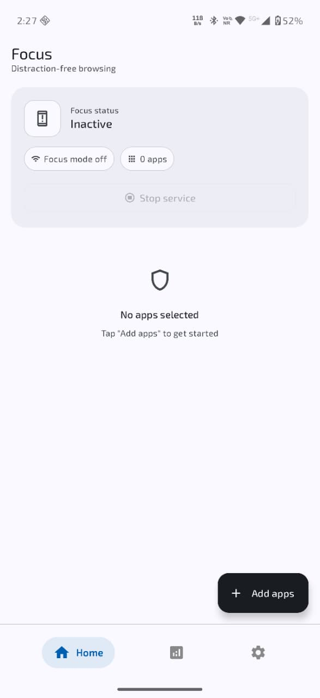
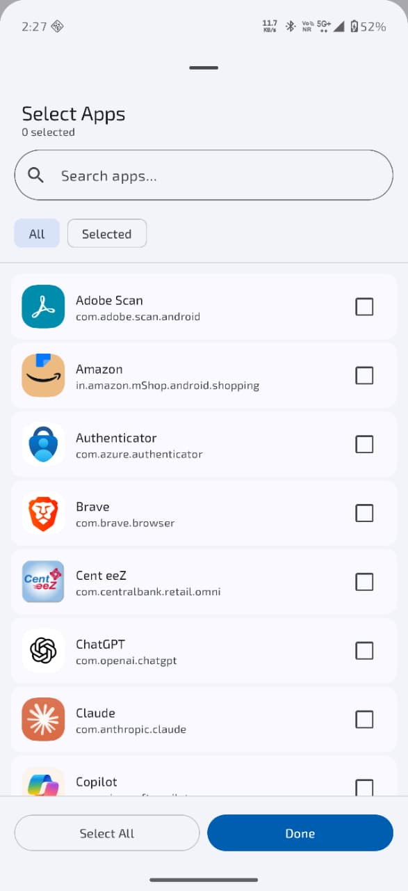
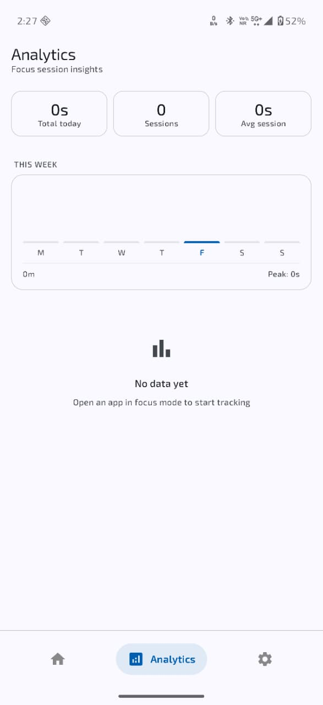
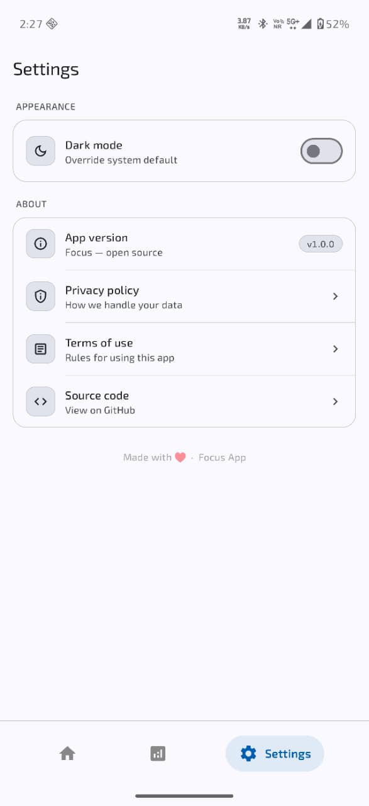

# Focus

Focus is an Android productivity application that helps users stay distraction-free by selectively blocking internet access for chosen applications using Android's VPN framework.

## Features

- App-level internet blocking
- Focus session management
- Usage analytics
- Modern Material 3 UI
- Dark mode support
- Local data persistence with Room
- Built with Jetpack Compose

## Screenshots

<p align="center">
  
  
  
  
</p>

## Tech Stack

- Kotlin
- Jetpack Compose
- MVVM
- Hilt
- Room Database
- Android VPN Service
- Material 3

## Installation

```bash
git clone https://github.com/saurabhkaipurkar/FocusApp.git
```

Open in Android Studio and run.

## License

MIT License
